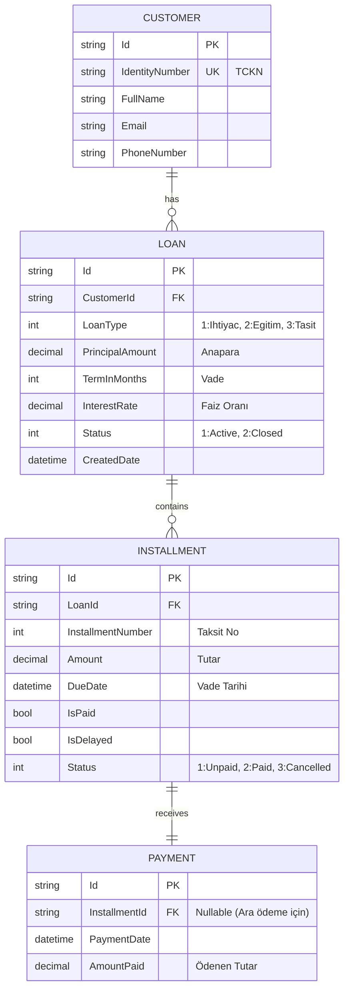

# 📊 Dijital Kredi Yönetim Sistemi (Digital Loan System)

Müşteri kredilerini yönetmek, taksit planları oluşturmak ve ödeme işlemlerini gerçekleştirmek için tasarlanmış modern, eksiksiz bir kredi yönetim sistemi.

## 🎯 Özellikler

### ✅ Müşteri Yönetimi
- Müşteri oluşturma, güncelleme, silme
- Müşteri detaylarını görüntüleme
- TCKN duplikasyon kontrolü
- Finansal özet (toplam borç, kalan anapara, gecikmiş taksitler)

### 💰 Kredi Yönetimi
- 3 kredi türü desteği: İhtiyaç, Eğitim, Taşıt
- Otomatik taksit planı oluşturma
- Kredi statüsü takibi (Active, Closed)
- Kalan anapara hesaplama

### 📅 Taksit Sistemi
- Dinamik taksit planı
- Ödeme durumu takibi (Ödendi, Ödenmedi, Gecikmiş, Cancelled)
- Üstün ödeme desteği
- Erken kapatma işlemleri

### 💳 Ödeme İşlemleri
- Bireysel taksit ödemeleri
- Kısmi erken ödeme (Partial Early Repayment)
- Yeniden yapılandırma seçenekleri
- Ödeme geçmişi takibi

### 📈 Finansal Analiz
- Müşteri başına Toplam Borç hesaplama
- Kalan Anapara hesaplama
- Gecikmiş taksitler raporlama
- Kredi performans metrikleri

---

## 🏗️ Mimari

### Teknoloji Stack

**Backend:**
- **.NET 8** - Uygulama framework'ü
- **Entity Framework Core 8** - ORM
- **Pomelo MySQL** - MySQL veritabanı
- **FluentValidation** - Veri doğrulama (genişletilebilir)

**Frontend:**
- **React 18** - UI framework
- **Vite** - Build tool
- **React Router** - Navigasyon
- **Axios** - HTTP client

**Database:**
- **MySQL** - İlişkisel veritabanı

---

## 🚀 Kurulum

### Ön Gereksinimler

- **.NET 8 SDK** ([İndir](https://dotnet.microsoft.com/download))
- **Node.js 18+** ([İndir](https://nodejs.org))
- **MySQL Server 8+** ([İndir](https://dev.mysql.com/downloads/mysql/))
- **Visual Studio 2022** veya **VS Code**

### 1. Backend Kurulumu

```bash
# Repository'yi klonla
git clone https://github.com/AbdulsametEkinci/DigitalLoanSystem.git
cd DigitalLoanSystem

# appsettings.json'u düzenle
# API/appsettings.json dosyasında MySQL bağlantısını ayarla
# "DefaultConnection": "Server=localhost;Database=DigitalLoanDb;User=root;Password=your_password;"

# Veritabanı migration'ları çalıştır
cd Infrastructure
dotnet ef database update

# Backend'i başlat
cd ../API
dotnet run
# API http://localhost:7113 adresinde çalışacak
```

### 2. Frontend Kurulumu

```bash
# Frontend dizinine git
cd digital-loan-frontend

# Dependencies'leri yükle
npm install

# Development server'ı başlat
npm run dev
# Frontend http://localhost:5173 adresinde çalışacak
```

### 3. API Base URL Konfigürasyonu

Frontend'de API bağlantısını kontrol et:
```javascript
// digital-loan-frontend/src/api/axiosConfig.js
const apiClient = axios.create({
    baseURL: 'https://localhost:7113/api',
    headers: {
        'Content-Type': 'application/json'
    }
});
```

---

## 📊 Veri Tabanı (ER Diagram)



---

## 🔌 API Endpoint Listesi

Detaylı API dokümantasyonu için bkz: **[API_DOCUMENTATION.md](./API_DOCUMENTATION.md)**

### Özet

| Modül | Metod | Endpoint | Açıklama |
|-------|-------|----------|----------|
| **Müşteriler** | GET | `/api/customers` | Tüm müşterileri listele |
| | GET | `/api/customers/{id}` | Müşteri detaylarını getir |
| | GET | `/api/customers/{id}/summary` | Müşteri finansal özetini getir |
| | POST | `/api/customers` | Yeni müşteri oluştur |
| | PUT | `/api/customers/{id}` | Müşteri bilgilerini güncelle |
| | DELETE | `/api/customers/{id}` | Müşteri sil |
| **Krediler** | GET | `/api/loans/{id}` | Kredi detaylarını getir |
| | POST | `/api/loans` | Yeni kredi başvurusu (kredi çek) |
| **Taksitler** | GET | `/api/installments/{id}` | Taksit detaylarını getir |
| **Ödemeler** | POST | `/api/payments` | Taksit öde |
| | POST | `/api/loans/{id}/partial-repayment` | Kısmi erken ödeme |
| | GET | `/api/loans/{id}/restructuring-options` | Yeniden yapılandırma seçenekleri |

---

## 💻 Kullanım Örneği

### 1. Müşteri Oluştur
```bash
curl -X POST https://localhost:7113/api/customers \
  -H "Content-Type: application/json" \
  -d '{
    "identityNumber": "12345678901",
    "fullName": "Ahmet Yılmaz",
    "email": "ahmet@example.com",
    "phoneNumber": "+905551234567"
  }'
```

### 2. Kredi Çek (Başvur)
```bash
curl -X POST https://localhost:7113/api/loans \
  -H "Content-Type: application/json" \
  -d '{
    "customerId": "customer-uuid",
    "loanType": 1,
    "principalAmount": 50000,
    "termInMonths": 12
  }'
```

### 3. Taksit Öde
```bash
curl -X POST https://localhost:7113/api/payments \
  -H "Content-Type: application/json" \
  -d '{
    "installmentId": "installment-uuid",
    "amount": 4500,
    "cardNumber": "4532XXXXXXXXXXXX",
    "expiryDate": "12/25"
  }'
```

---

## 🔐 Güvenlik Notları

### CORS Konfigürasyonu
Şu anda CORS `http://localhost:5173` (Vite frontend) için açık. Production'da bunu sınırlandırmalısınız:

```csharp
// API/Program.cs
builder.Services.AddCors(options =>
{
    options.AddPolicy("AllowReact", policy => 
        policy.WithOrigins("https://yourdomain.com")
              .AllowAnyHeader()
              .AllowAnyMethod());
});
```

### HTTPS
Production'da her zaman HTTPS kullanın ve SSL sertifikası yapılandırın.

---

## 🧪 Test Etme

### Manual Test
Frontend'de `/customers` sayfasından:
1. Yeni müşteri oluştur
2. Müşteri seç → Detay sayfasına git
3. "Yeni Kredi Çek" → Kredi başvurusunu tamamla
4. Taksitlerde "Öde" butonuna tıkla
5. Ödeme işlemini gerçekleştir

### Otomatik Testler (Gelecek)
```bash
dotnet test
npm run test  # Frontend testleri
```

---

## 📝 İş Kuralları

### Kredi Onayı (Henüz implement edilmedi)
- Müşteri credit score ≥ 500 ise kredi onaylanır
- Kredi tutar: Min 1.000 TL, Max 500.000 TL
- Vade: Min 3 ay, Max 120 ay

### Ödeme
- Sadece **Active** krediler için ödeme yapılabilir
- **Cancelled** krediler için ödeme engellenir
- Taksit günü gelmemiş ise ödeme yapılamaz (frontend)

### Erken Ödeme
- Toplam borçtan daha fazla ödeme yapılamaz
- Partial repayment → taksitler yeniden yapılandırılır
- Full repayment → kredi otomatik kapanır

---